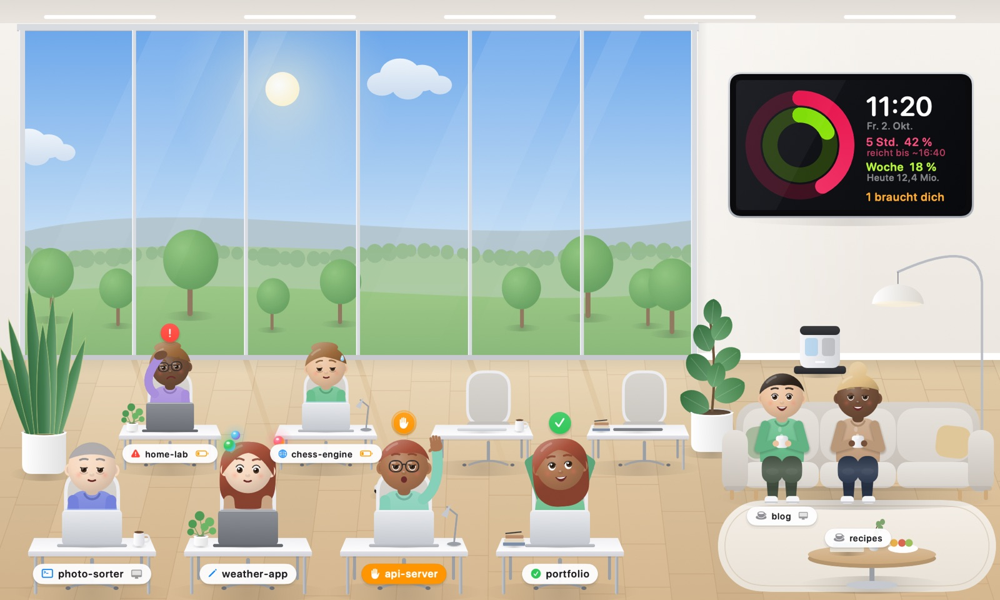
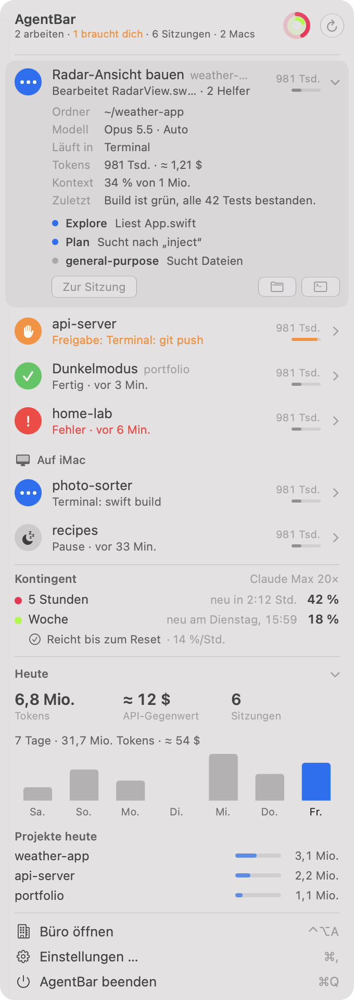
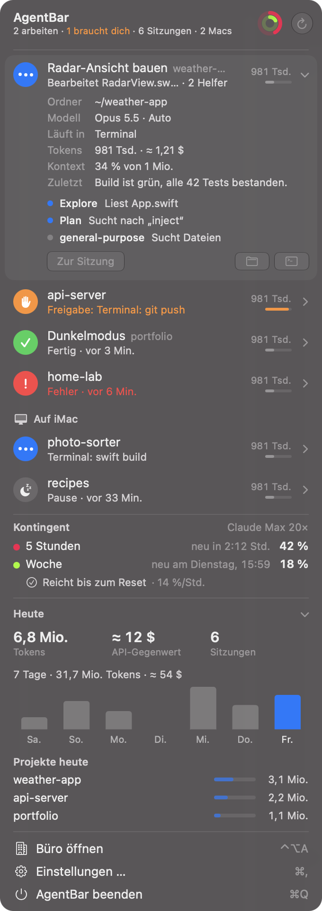
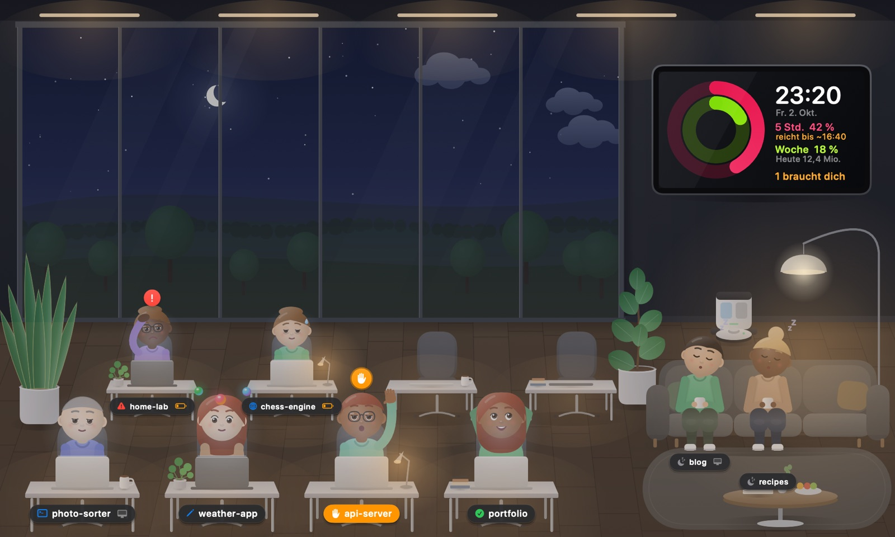

<p align="center">
  
</p>

<h1 align="center">AgentBar</h1>

<p align="center">
  Eine Menüleisten-App für macOS, die zeigt, was deine <a href="https://docs.anthropic.com/en/docs/claude-code">Claude-Code</a>-Agenten gerade tun –<br>
  im Stil eines eingebauten macOS-27-Menüs, mit einem kleinen animierten Büro, in dem jede Sitzung an ihrem eigenen Schreibtisch sitzt.
</p>

<p align="center">
  <a href="README.md">🇬🇧 English</a> · 🇩🇪 Deutsch
</p>

<p align="center">
  <a href="https://github.com/SH1FT-W/agentbar/releases/latest">Download</a> ·
  <a href="https://sh1ft-w.github.io/agentbar/">Website</a> ·
  <a href="#einrichten">Einrichten</a>
</p>

<p align="center">
  
</p>

<p align="center">
  
  &nbsp;
  
</p>

> **Sprache:** AgentBar folgt der Sprache deines Macs – Deutsch oder Englisch.

## Funktionen

- **Status in Echtzeit** – arbeitet, braucht dich, fertig, Fehler oder Pause, für jede Claude-Code-Sitzung (Terminal, Claude-App, Cowork, Xcode). Subagenten erscheinen als Helfer ihrer Sitzung.
- **Präzise Erkennung (optional)** – mit Claude-Code-Hooks weiß AgentBar *genau*, wann ein Agent auf deine Freigabe wartet, statt es aus Pausen zu schätzen.
- **Kontingent-Ringe** – dein 5-Stunden- und Wochenkontingent als Aktivitätsringe wie auf der Apple Watch, dazu eine Prognose, wie lange das 5-Stunden-Fenster beim aktuellen Tempo reicht. Das OAuth-Token wird nur *gelesen*, nie erneuert oder verändert.
- **Heute & letzte 7 Tage** – Tokens, API-Gegenwert und Sitzungen pro Tag, ein 7-Tage-Balkendiagramm und deine Top-Projekte von heute. Lokal aus den Sitzungsprotokollen von Claude Code berechnet.
- **Kontext auf einen Blick** – jede Zeile zeigt Tokens und einen kleinen Kontext-Balken, der orange wird, wenn das Kontextfenster fast voll ist.
- **Das Büro** – ein schwebendes Fenster (⌃⌥A), in dem jede Sitzung eine Memoji-artige Figur ist: Sie tippt beim Arbeiten, hebt die Hand, wenn sie dich braucht, geht in der Pause zum Sofa, an die Kaffee-Ecke oder ans Fenster und wirkt umso müder, je voller ihr Kontextfenster ist (nach /compact wieder frisch). Der Himmel folgt der Tageszeit, Helfer kreisen als leuchtende Kugeln, ein Saugroboter wird mit der CPU-Last schneller und fährt abends, wenn das Licht angeht, in seine Ladestation.
- **Direkt zur Sitzung** – ein Klick auf eine Sitzung (im Menü oder im Büro) holt ihren Terminal-Tab nach vorn.
- **Mitteilungen**, wenn ein Agent dich braucht (mit seiner konkreten Frage), fertig ist oder scheitert, wenn sein Kontext fast voll ist oder er zu hängen scheint, dazu eine Kontingent-Warnung und ein Hinweis auf neue AgentBar-Versionen. Mit Knöpfen „Zur Sitzung“ und „1 Std. stumm“ sowie optionalen Ruhezeiten.
- **Tastatur und VoiceOver** – ↑/↓ wählen, Return springt zur Sitzung, Leertaste klappt auf, ⌘R lädt neu; jede Zeile und jeder Ring hat eine Bedienhilfen-Beschriftung.
- **Deine anderen Macs** (optional) – koppel deine Macs per Code, dann erscheinen Sitzungen der anderen im Menü und im Büro, markiert mit einem kleinen Geräte-Symbol. Gefunden wird per Bonjour im lokalen Netzwerk, jede Nachricht ist mit dem Code verschlüsselt.
- **Wach bleiben** – aus, immer oder nur, solange Agenten arbeiten.
- **Updates** über GitHub-Releases, geprüft per Ed25519-Signatur (Schlüssel fest in der App), Bundle-ID, Version und Code-Signatur.

<p align="center">
  
</p>

## Einrichten

### Voraussetzungen

- macOS 14 oder neuer auf Apple Silicon (gebaut und getestet auf macOS 27)
- [Claude Code](https://docs.anthropic.com/en/docs/claude-code) – AgentBar liest dessen lokale Sitzungsprotokolle

### Installieren

1. `AgentBar.zip` aus dem [neuesten Release](https://github.com/SH1FT-W/agentbar/releases/latest) laden und entpacken.
2. `AgentBar.app` in den Ordner **Programme** ziehen.
3. **Gatekeeper:** AgentBar ist Open Source, aber nicht von Apple notarisiert (dafür braucht es einen kostenpflichtigen Entwickler-Account). macOS blockiert deshalb den ersten Start mit *„AgentBar“ kann nicht geöffnet werden*. Einmal erlauben, auf eine der beiden Arten:
   - **Systemeinstellungen → Datenschutz & Sicherheit** öffnen, nach unten zu *„AgentBar“ wurde blockiert …* scrollen, **Trotzdem öffnen** klicken und bestätigen; **oder**
   - im Terminal:
     ```sh
     xattr -dr com.apple.quarantine /Applications/AgentBar.app
     ```
   Das ist nur einmal nötig. Spätere Updates über den eingebauten Update-Button kommen ohne diese Abfrage aus – sie werden stattdessen per Ed25519-Signatur geprüft.
4. Starten – oben in der Menüleiste erscheint ein ✦-Symbol. Ein Dock-Symbol gibt es nicht.

### Erster Start

- **Mitteilungen:** macOS fragt einmal, ob AgentBar Mitteilungen senden darf.
- **Präzise Erkennung:** im Menü bei *Präzise Erkennung* auf **Einrichten** klicken (oder *Einstellungen → Präzise Erkennung*). AgentBar trägt kleine Hook-Befehle in `~/.claude/settings.json` ein (eine Sicherung landet in `settings.json.agentbar-backup`). Jeder Hook hängt nur eine Statuszeile an `~/Library/Application Support/AgentBar/hooks.log` an – kein Netzwerk, keine Prompts oder Dateiinhalte. Gilt für danach gestartete Claude-Sitzungen und lässt sich in den Einstellungen jederzeit wieder entfernen.
- **Kontingent-Ringe:** AgentBar liest den Login von Claude Code aus dem Schlüsselbund (`Claude Code-credentials`) über das `security`-Werkzeug. Falls macOS fragt: erlauben. Das Token geht nur an `api.anthropic.com`.
- **Zum Terminal springen:** Beim ersten Klick auf eine Sitzung fragt macOS, ob AgentBar das Terminal steuern darf – das dient nur dazu, den richtigen Tab auszuwählen.
- **Beim Anmelden starten:** in *Einstellungen → Allgemein* einschalten.

### Tastenkürzel

| Kürzel | Aktion |
|---|---|
| ⌃⌥A | Büro zeigen / ausblenden (systemweit) |
| ⌘, | Einstellungen (bei geöffnetem Menü) |

## Selbst bauen

Xcode ist nicht nötig – die Command Line Tools reichen (`xcode-select --install`).

```sh
git clone https://github.com/SH1FT-W/agentbar.git
cd agentbar
./build.sh            # → build/AgentBar.app
./build.sh install    # → nach /Applications kopieren und starten
./build.sh snapshot   # → Büro + Menü als PNG nach build/
```

`build.sh` nimmt bevorzugt ein macOS-26-SDK aus den Command Line Tools (dem SDK 27 dort fehlt das SwiftUI-Macro-Plugin); überschreibbar mit `SDK=/pfad/zum/sdk ./build.sh`.

Diagnose: `build/AgentBar.app/Contents/MacOS/AgentBar --dump` listet die erkannten Sitzungen und beendet sich. Sprache testen: `AGENTBAR_LANG=en` bzw. `=de`.

## Datenschutz

Alles bleibt auf deinem Mac. AgentBar liest nur lokale Dateien (`~/.claude/projects`, Metadaten der Claude-App, das eigene Hook-Log) und spricht mit genau zwei Servern:

- `api.anthropic.com` – dein Kontingent (nur wenn *Kontingent abrufen* an ist)
- `api.github.com` – Update-Prüfung

Schaltest du *Andere Macs* ein, spricht AgentBar zusätzlich mit deinen gekoppelten Macs im lokalen Netzwerk (Bonjour, mit dem Kopplungscode verschlüsselt). Geteilt werden nur Status, Projekt, Titel und Tätigkeit der Sitzungen – nie Dateien oder Protokolle.

Keine Analyse, keine Telemetrie.

## So funktioniert die Erkennung

Ohne Hooks liest AgentBar die JSONL-Protokolle von Claude Code und leitet den Zustand ab (z. B.: ein Werkzeugaufruf ohne Ergebnis in einem Modus mit Rückfragen wartet vermutlich auf Freigabe). Mit Hooks meldet Claude Code `PreToolUse`, `PermissionRequest`, `Notification`, `Stop` usw. direkt, und AgentBar prüft zusätzlich, ob der Claude-Prozess noch läuft.

## Dank

Inspiriert von [so-agentbar](https://github.com/sotthang/so-agentbar) von sotthang – AgentBar ist eine eigenständige Neuentwicklung mit anderem Design und Funktionsumfang.

## Lizenz

[MIT](LICENSE). AgentBar ist ein unabhängiges Projekt, nicht verbunden mit Anthropic oder Apple. Claude ist eine Marke von Anthropic.
