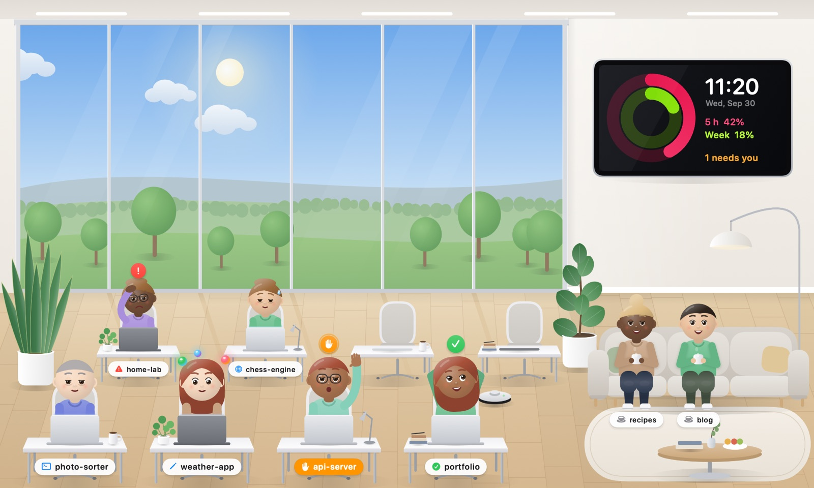
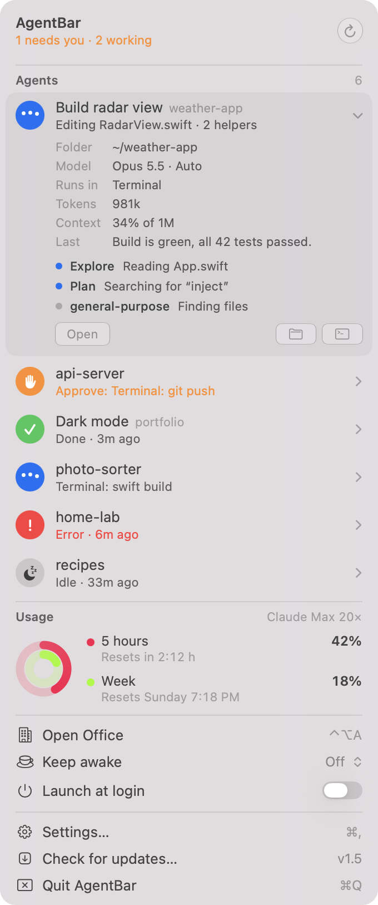
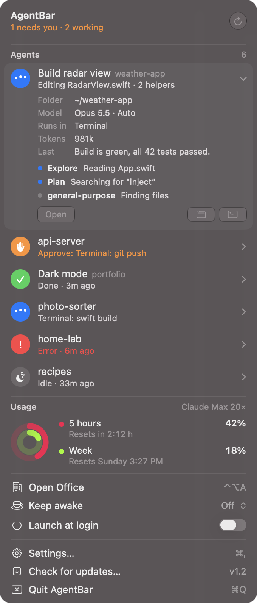
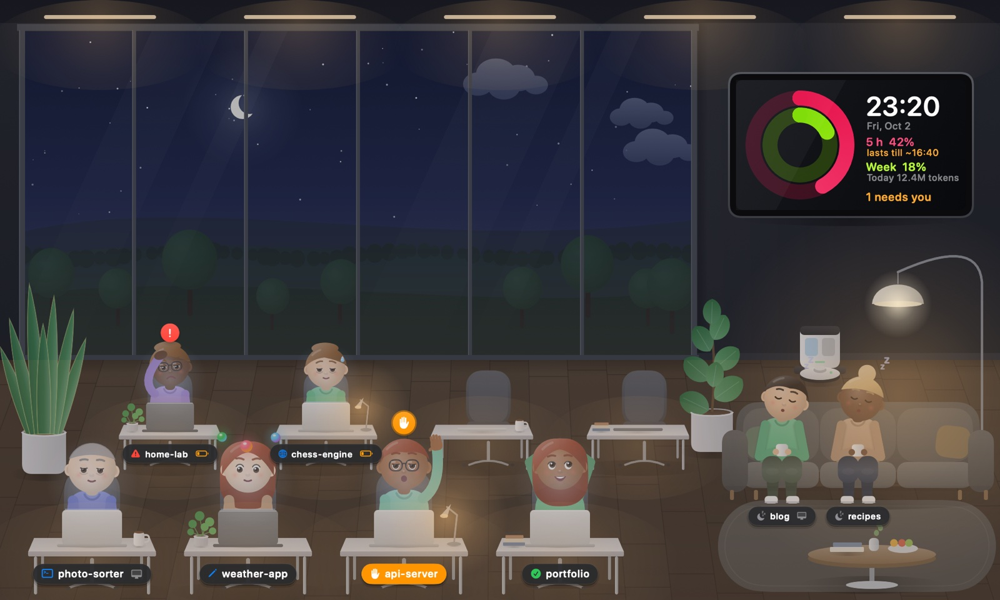
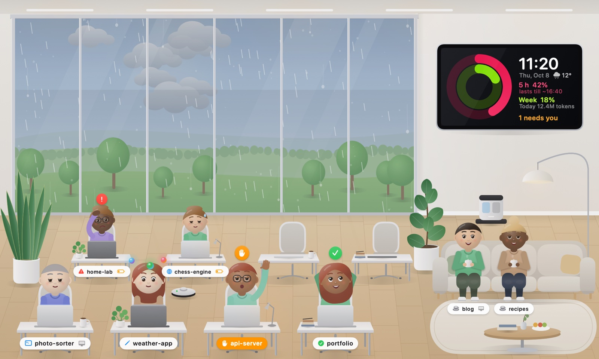
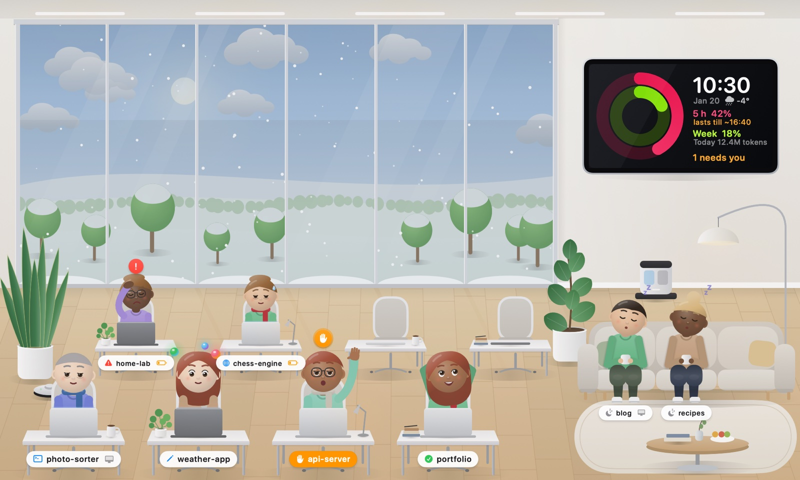
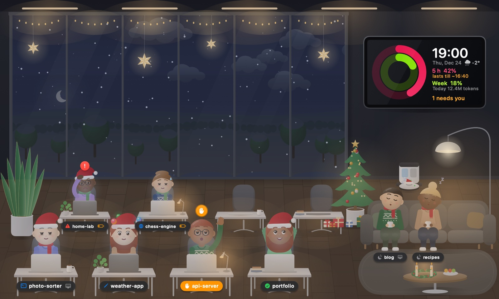
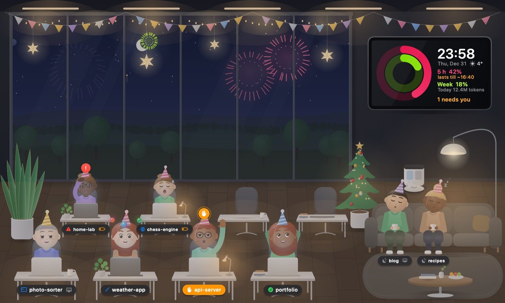

<p align="center">
  
</p>

<h1 align="center">AgentBar</h1>

<p align="center">
  A macOS menu bar app that shows what your <a href="https://docs.anthropic.com/en/docs/claude-code">Claude Code</a> agents are doing –<br>
  styled like a native macOS 27 system menu, with a little animated office where every session sits at its own desk.
</p>

<p align="center">
  🇬🇧 English · <a href="README.de.md">🇩🇪 Deutsch</a>
</p>

<p align="center">
  <a href="https://github.com/SH1FT-W/agentbar/releases/latest">Download</a> ·
  <a href="https://sh1ft-w.github.io/agentbar/">Website</a> ·
  <a href="#setup">Setup</a>
</p>

<p align="center">
  
</p>

<p align="center">
  
  &nbsp;
  
</p>

> **Language:** AgentBar follows your macOS language – German or English.

## Features

- **Live session status** – working, needs you, done, error or idle, for every Claude Code session (terminal, Claude desktop app, Cowork, Xcode). Subagents appear as helpers of their parent session.
- **Precise detection (optional)** – with Claude Code hooks AgentBar knows *exactly* when an agent is waiting for your approval instead of guessing from pauses.
- **Usage rings** – your 5-hour and weekly Claude plan usage as Apple-Watch-style activity rings, plus a forecast of how long your 5-hour window will last at the current pace. The OAuth token is only *read*, never refreshed or modified.
- **Today & last 7 days** – tokens, API-equivalent cost and sessions per day, a 7-day bar chart and your top projects today. Computed locally from Claude Code's session logs.
- **Context at a glance** – every row shows tokens and a small context bar that turns orange when the context window is almost full.
- **The office** – a floating window (⌃⌥A) where each session is a Memoji-like character: typing while working, raising a hand when it needs you, walking over to the lounge for a coffee when idle, and looking more and more tired as its context window fills up (fresh again after /compact). The sky follows the time of day and, if you enter a location, the real weather (clouds, rain, fog, storms, snow that settles, real sunrise and sunset); the office decorates itself for Advent, Christmas and New Year's Eve, and the team dresses up for the season and the weather; helpers orbit as glowing spheres; a robot vacuum speeds up with your CPU load and heads back to its charging dock when the lights go on in the evening.
- **Jump to the session** – click a figure in the office, or use “Go to Session” (or Return) in the menu, to bring its Terminal tab to the front.
- **Notifications** when an agent needs you (with the actual question it asks), finishes or fails, when its context is almost full or it seems stuck, plus a usage warning and a heads-up when a new AgentBar version is out. Actions to jump to the session or mute it for an hour, and optional quiet hours.
- **Keyboard and VoiceOver** – ↑/↓ to select, Return to jump to the session, Space to expand, ⌘R to reload; every row and ring has a proper accessibility label.
- **Your other Macs** (optional) – pair your Macs with a code and sessions running on the others show up in the menu and in the office, marked with a small device symbol. Discovery via Bonjour on your local network, every message encrypted with the pairing code.
- **Keep awake** – off, always, or only while agents are working.
- **Updates** via GitHub Releases – a small window at launch offers Install Now, Later or Skip (it never steals keyboard focus) – verified with an Ed25519 signature (key compiled into the app), bundle ID, version and code signature.

<p align="center">
  
</p>

<p align="center">
  
  
</p>
<p align="center">
  
  
</p>

## Setup

### Requirements

- macOS 14 or later on Apple Silicon (built and tested on macOS 27)
- [Claude Code](https://docs.anthropic.com/en/docs/claude-code) – AgentBar reads its local session logs

### Install

1. Download `AgentBar.zip` from the [latest release](https://github.com/SH1FT-W/agentbar/releases/latest) and unzip it.
2. Move `AgentBar.app` to `/Applications`.
3. **Gatekeeper:** AgentBar is open source but not notarized by Apple (that requires a paid developer account), so macOS blocks the first launch with *“AgentBar” can't be opened / Apple could not verify…*. Allow it once, either way:
   - Open **System Settings → Privacy & Security**, scroll down to *“AgentBar” was blocked…* and click **Open Anyway**, then confirm; **or**
   - in Terminal:
     ```sh
     xattr -dr com.apple.quarantine /Applications/AgentBar.app
     ```
   You only need to do this once. Later updates via the built-in update button install without this prompt – they are verified with an Ed25519 signature instead.
4. Launch it – a small Clawd icon appears in the menu bar. There is no Dock icon.

### First run

- **Notifications:** macOS asks once whether AgentBar may send notifications.
- **Precise detection:** click **Set up** on the *Precise detection* card in the dropdown (or *Settings → Precise detection*). AgentBar adds small hook commands to `~/.claude/settings.json` (a backup is written to `settings.json.agentbar-backup`). Each hook appends one line to `~/Library/Application Support/AgentBar/hooks.log` – no network, no AgentBar process involved. Applies to Claude sessions started afterwards. You can remove the hooks again at any time from the settings.
- **Usage rings:** AgentBar reads Claude Code's login from the keychain (`Claude Code-credentials`) via the `security` tool. If macOS asks, allow it. The token is sent only to `api.anthropic.com`.
- **Jump to Terminal:** the first time you jump to a session, macOS asks whether AgentBar may control Terminal – this is used only to select the right tab.
- **Launch at login:** toggle *Launch at login* in *Settings → General*.

### Shortcuts

| Shortcut | Action |
|---|---|
| ⌃⌥A | Show / hide the office (global) |
| ⌘, | Settings (while the dropdown is open) |

## Build from source

No Xcode needed – the Command Line Tools are enough (`xcode-select --install`).

```sh
git clone https://github.com/SH1FT-W/agentbar.git
cd agentbar
./build.sh            # → build/AgentBar.app
./build.sh install    # → copies to /Applications and launches
./build.sh snapshot   # → renders the office + dropdown as PNGs into build/
```

`build.sh` prefers a macOS 26 SDK from the Command Line Tools (the SDK 27 in the Command Line Tools lacks the SwiftUI macro plugin); override with `SDK=/path/to/sdk ./build.sh`.

Diagnostics: `build/AgentBar.app/Contents/MacOS/AgentBar --dump` lists the detected sessions and exits.

## Privacy

Everything stays on your Mac. AgentBar only reads local files (`~/.claude/projects`, Claude desktop metadata, its own hook log) and talks to these servers:

- `api.anthropic.com` – your plan usage (only if *Fetch usage* is on)
- `api.github.com` – checking for updates
- `api.open-meteo.com` and `geocoding-api.open-meteo.com` – weather behind the office window (only once you enter a location; only the location, rounded to about 1 km, is sent)

If you turn on *Other Macs*, AgentBar also talks to your paired Macs on the local network (Bonjour, encrypted with the pairing code). Only the status, project, title and activity of sessions are shared – never files or logs.

No analytics, no telemetry.

## How status detection works

Without hooks, AgentBar parses the Claude Code JSONL logs and infers the state (e.g. a tool call that isn't followed by a result for a while in a non-auto permission mode probably waits for approval). With hooks, Claude Code reports `PreToolUse`, `PermissionRequest`, `Notification`, `Stop` etc. directly, and AgentBar also checks whether the Claude process is still alive.

## Credits

Inspired by [so-agentbar](https://github.com/sotthang/so-agentbar) by sotthang – AgentBar is an independent rewrite with a different design and feature set.

## License

[MIT](LICENSE). AgentBar is an independent project, not affiliated with Anthropic or Apple. Claude is a trademark of Anthropic.
